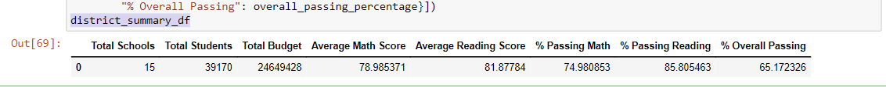
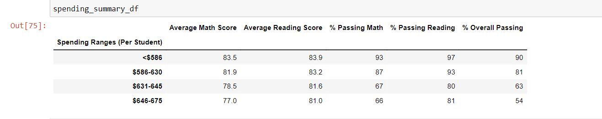

# School_District_Analysis

### Overview of the school district analysis: Explain the purpose of this analysis.

We have been tasked by Chief Data Scientist (CDS) to prepare all standardized test data for analysis, reporting, and presentatio  to proivide insights about performance trends and patterns 

These insights will help in informed discussions and decision at strategic school district level. We will help CDS in 
- analyzing data on student funding and students' standardized tests scores. 
- We will have access to every students' math and reading scores and schools they attend 

We will help CDS to aggregate data and show trends in school  performance
- This analysis will assist the school board in making decisions on school budget allocations

Tools/Languages Used: Python (Jupyter notebook, Pandas)

Skills applied: 
 - Cleaning and inspecting Data
 - Merging data sets
 - Performing calculations
 - Create Tables
 

## Results: 

### How is the district summary affected?

old_district_summary_df

new_district_summary_df

### How is the school summary affected?
old per_school_summary_df
.png)

new per_school_summary_df
.png)

### How does replacing the ninth graders’ math and reading scores affect Thomas High School’s performance relative to the other schools?
After removing the ninth graders' math and reading scores the average grades are not affected significantly

### How does replacing the ninth-grade scores affect the following:

### Math and reading scores by grade
reading_scores_by_grade
.png)

math_scores_by_grade
.png)

### Scores by school spending
spending_summary_df

### Scores by school size
size_summary_df

### Scores by school type
type_summary_df

### Summary: Summarize changes in the updated school district analysis after reading and math scores for the ninth grade at Thomas High School have been replaced with NaNs.

Dealing with missing values is crucial and it may affect the analysis and may lead to wrong decisions. Ninth grader was replaced with Nans as this would not affected the summary because replacing it with zero will affect the average and would give incorrect average information

School ranking has not changed 

